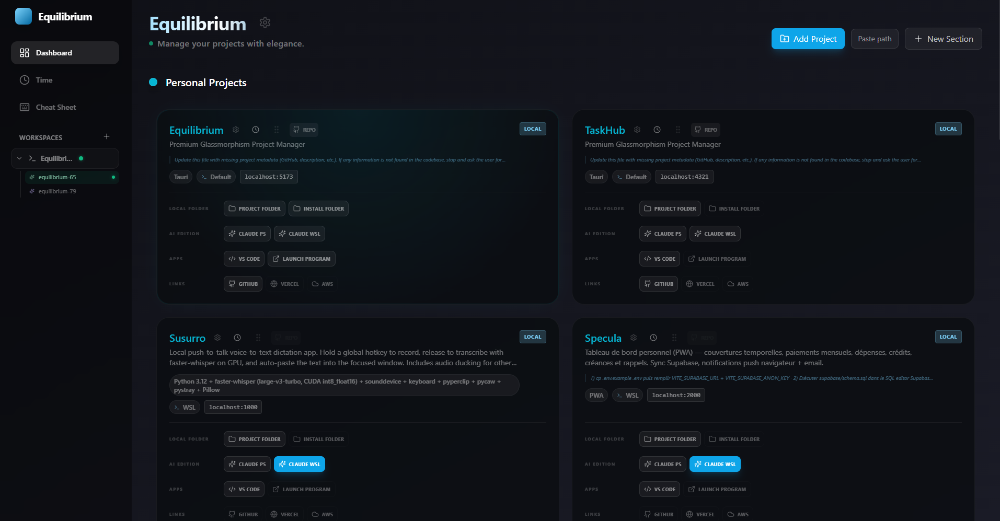
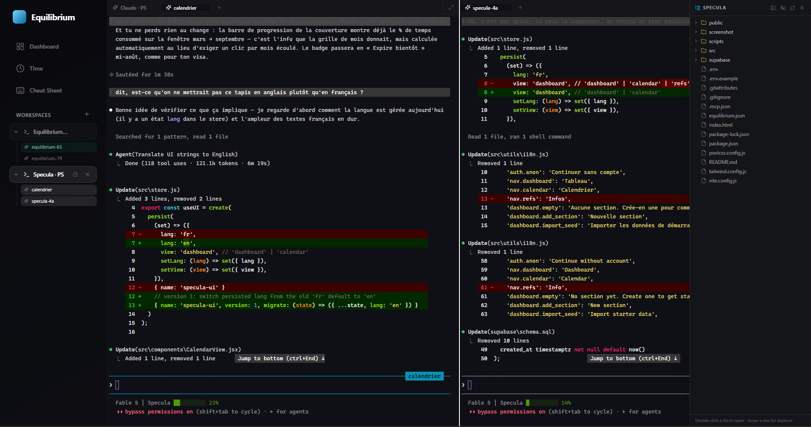
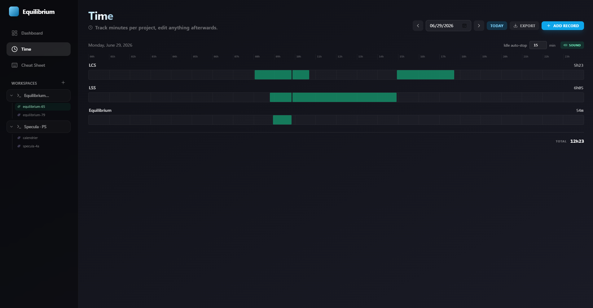
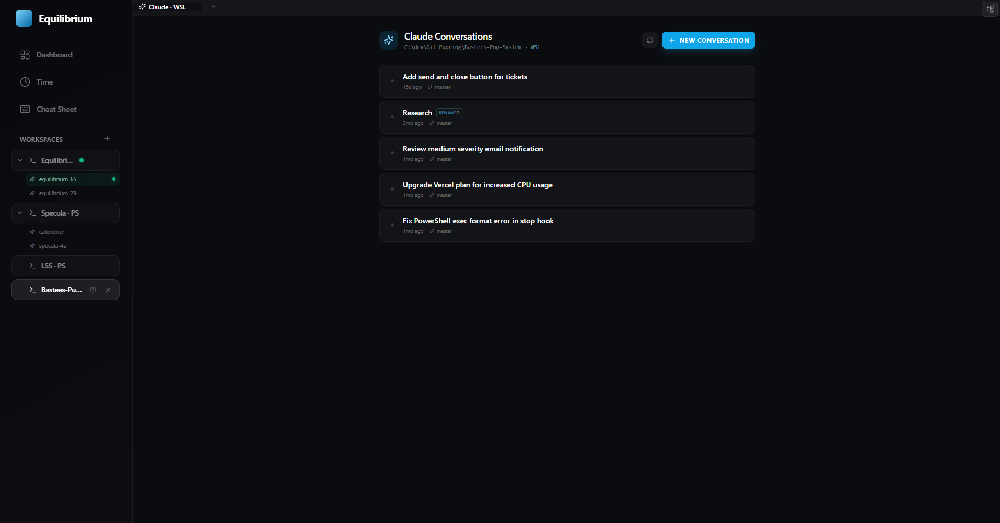

<div align="center">

# Equilibrium

### A desktop cockpit for developers working with Claude Code

Manage your projects, run terminals, browse your Claude Code conversation history, and track your time — all in one glassmorphism-styled Windows app.

[](#requirements)
[](https://tauri.app)
[](LICENSE)



</div>

---

## What is Equilibrium?

Equilibrium is a local desktop app (Tauri 2 + Next.js) built for developers who juggle several projects and spend their day inside Claude Code. It puts everything in one window:

- **Project dashboard** — all your local projects as cards, grouped into colored, drag-and-drop sections. Open a project in VS Code, Explorer, or launch its dev server with one click. A port monitor shows live which dev servers are running.
- **Workspaces with real terminals** — tabbed workspaces per project with true PTY terminals (PowerShell or WSL), split panes, in-app browser tabs, and a retractable file explorer. Terminals support image paste (great for Claude vision input), smart clipboard handling, and WSL path translation.
- **Claude Code session browser** — reads your local Claude Code history (`~/.claude/projects`) and shows every conversation per project: title, last activity, git branch, live working/idle status. Resume any session in one click (`claude --resume`), rename sessions, and keep names in sync with Claude's own `/rename`. Handles separate PowerShell and WSL histories.
- **Time tracking** — a per-project chronometer with idle auto-stop, backdated entries, a manual entry editor, a 24-hour timeline view, and CSV export (projects × days matrix, Excel-ready).
- **Cheat sheet** — a built-in Claude Code reference for shortcuts, slash commands, and CLI flags.

Everything runs and stays **100% local**. Equilibrium makes no network calls to any third-party service; your Claude transcripts are read from disk, read-only, and never leave your machine.

<div align="center">

</div>

## Screenshots

| Dashboard | Time tracking |
|---|---|
|  |  |

| Workspace (terminals + explorer) | Claude conversations |
|---|---|
|  |  |

## ⚠️ A note on the Claude Code history format

The session browser reads Claude Code's **internal, undocumented** on-disk format (`~/.claude/projects/*.jsonl` and `~/.claude/sessions/`). Anthropic can change this format at any time without notice, which may break the session browser until Equilibrium is updated. The rest of the app (dashboard, terminals, time tracking) does not depend on it.

## Requirements

- **Windows 10/11** — the app is Windows-only for now (WSL integration, ConPTY, WebView2, `taskkill`-based process management).
- [WebView2 Runtime](https://developer.microsoft.com/en-us/microsoft-edge/webview2/) (preinstalled on Windows 11).
- [Claude Code](https://claude.com/claude-code) installed, if you want the session browser (optional).
- WSL, if you want WSL terminals (optional).

## Installation

Download the latest installer (`.exe`) from the [Releases](../../releases) page and run it.

### Build from source

Prerequisites: [Node.js](https://nodejs.org) 20+, [Rust](https://rustup.rs) (stable), and the [Tauri 2 prerequisites](https://tauri.app/start/prerequisites/) for Windows.

```powershell
git clone https://github.com/Seb77570/Equilibrium.git
cd Equilibrium
npm install

# Development (hot reload)
npm run tauri dev

# Production build (installer in src-tauri/target/release/bundle/)
npm run tauri build
```

## Where your data lives

All app data is stored locally in `%APPDATA%\com.equilibrium.dashboard`:

| File | Contents |
|---|---|
| `projects.json` | Your registered projects and their metadata |
| `dashboard.json` | Section names, colors, and project order |
| `time_tracking.json` | Time tracking entries |
| `time_settings.json` | Idle threshold and sound settings |
| `settings.json` | App settings (default agent command) |
| `claude_session_labels.json` | Your custom session names |

Claude Code transcripts are read in place from `~/.claude` (Windows and/or WSL) and are never modified.

## Known limitations

- **Windows-only.** Linux/macOS would require reworking the PTY, process-management, and shell-integration layers. Contributions welcome.
- **In-app browser tabs** may fail to keep you logged into sites that require third-party cookies in production builds.
- **Tab tear-off into a separate window** is implemented but disabled due to a WebView2 blank-window issue on Windows.

## Tech stack

Next.js 14 · React 18 · TypeScript · Tailwind CSS · Zustand · xterm.js · dnd-kit · Tauri 2 (Rust: portable-pty, tokio, axum)

## License

[MIT](LICENSE)
